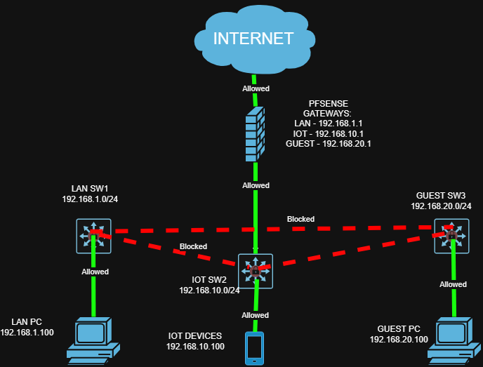

# pfsense-segmentation-homelab
virtual network segmentation using pfSense firewall with isolated LAN, IoT, Guest zones
# Home Network Segmentation with pfSense

## Overview
Built a virtualized segmented network using pfSense as a firewall/router 
in VirtualBox, simulating an enterprise network with isolated traffic zones.
The project demonstrates real-world network segmentation concepts used in 
corporate environments to isolate untrusted devices and guest users from 
the main network.

## Network Topology

## Network Design

| Segment | Interface | Subnet | Gateway | Purpose |
|---------|-----------|--------|---------|---------|
| LAN | em1 | 192.168.1.0/24 | 192.168.1.1 | Trusted devices |
| IoT | em2 | 192.168.10.0/24 | 192.168.10.1 | Untrusted/IoT devices |
| Guest | em3 | 192.168.20.0/24 | 192.168.20.1 | Guest network |

## Traffic Rules

| From | To | Result | Reason |
|------|----|--------|--------|
| LAN | Internet |  Allowed | Trusted devices need internet |
| IoT | Internet |  Allowed | IoT devices need internet |
| Guest | Internet |  Allowed | Guests need internet |
| LAN | IoT |  Blocked | Prevent lateral movement |
| LAN | Guest |  Blocked | Prevent lateral movement |
| IoT | LAN |  Blocked | Contain compromised IoT devices |
| IoT | Guest |  Blocked | Isolate untrusted segments |
| Guest | LAN |  Blocked | Protect main network |
| Guest | IoT |  Blocked | Isolate guest users |

## Tools Used
- VirtualBox 7.2.8 — Hypervisor
- pfSense CE 2.7.2 — Firewall/Router
- Lubuntu 24.04 — Client VMs (3x)
- draw.io — Network diagrams
- GitHub — Documentation and version control

## Environment
All VMs run on a single host machine using VirtualBox:

| VM | Role | Network |
|----|------|---------|
| pfsense-fw | Firewall/Router | WAN: NAT, LAN/OPT1/OPT2: Host-only Adapter |
| client-lan | Trusted PC | Host-only Adapter #1 (192.168.1.0/24) |
| client-iot | IoT Device | Host-only Adapter #2 (192.168.10.0/24) |
| client-guest | Guest Device | Host-only Adapter #3 (192.168.20.0/24) |

## How It Works
pfSense acts as the central firewall and router with four network 
interfaces; one WAN facing the internet via NAT, and three internal 
interfaces each serving a separate network segment using VirtualBox 
Host-only Adapters. DHCP is handled by pfSense on each segment. Firewall 
rules enforce strict inter-segment blocking while allowing internet 
access from all zones.

## Subnetting
Three /24 subnets were designed from the 192.168.0.0/16 private range:
- Each subnet provides 254 usable host addresses
- pfSense occupies the .1 address on each segment as the default gateway
- DHCP pools are configured from .100 to .200 on each segment
- Subnets use different third octets (1, 10, 20) to ensure complete
  network separation

## Firewall Rules

### LAN Interface
| Order | Action | Source | Destination | Description |
|-------|--------|--------|-------------|-------------|
| 1 | Block | LAN subnets | 192.168.10.0/24 | Block LAN to IoT |
| 2 | Block | LAN subnets | 192.168.20.0/24 | Block LAN to Guest |
| 3 | Pass | LAN subnets | Any | Allow LAN internet |

### OPT1 (IoT) Interface
| Order | Action | Source | Destination | Description |
|-------|--------|--------|-------------|-------------|
| 1 | Block | OPT1 subnets | 192.168.1.0/24 | Block IoT to LAN |
| 2 | Block | OPT1 subnets | 192.168.20.0/24 | Block IoT to Guest |
| 3 | Pass | OPT1 subnets | Any | Allow IoT internet |

### OPT2 (Guest) Interface
| Order | Action | Source | Destination | Description |
|-------|--------|--------|-------------|-------------|
| 1 | Block | OPT2 subnets | 192.168.1.0/24 | Block Guest to LAN |
| 2 | Block | OPT2 subnets | 192.168.10.0/24 | Block Guest to IoT |
| 3 | Pass | OPT2 subnets | Any | Allow Guest internet |

## Verification Testing
Each segment was tested with ping to verify correct behavior:

### Expected Results
| From | Destination | Result |
|------|-------------|----------|
| LAN | 8.8.8.8 |  Success |
| LAN | 192.168.10.1 |  Blocked |
| LAN | 192.168.20.1 |  Blocked |
| IoT | 8.8.8.8 |  Success |
| IoT | 192.168.1.1 |  Blocked |
| IoT | 192.168.20.1 |  Blocked |
| Guest | 8.8.8.8 |  Success |
| Guest | 192.168.1.1 |  Blocked |
| Guest | 192.168.10.1 |  Blocked |

## What I Learned
- pfSense firewall configuration and rule ordering
- Network segmentation design concepts used in enterprise environments
- DHCP server configuration across multiple interfaces
- VirtualBox virtual networking — NAT, Host-only Adapters
- Subnetting and IP addressing for isolated network zones
- Troubleshooting methodology — isolating problems layer by layer
- How hypervisors handle virtual network traffic between VMs
- Importance of bidirectional firewall rules for proper segmentation

## Screenshots
See [screenshots/](screenshots/) folder for full test results and 
configuration evidence.

## Files
- `/screenshots` — ping test results and pfSense configuration screenshots
- `/diagrams` — network topology diagram
- `/configs` — pfSense backup configuration XML
- `/troubleshooting.md` — issues encountered and fixes applied
- `/README.md` — project overview and documentation
